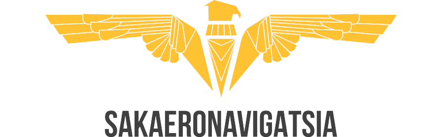

The \acr{OPDI} relies on partnerships with academic institutions, research organisations, air navigation service providers, and open-data communities. Partners contribute across the full spectrum of OPDI activities — from hosting sensors at airports and co-developing algorithms and practical tools for OPDI Data, to designing and running the PRC Data Challenges.

## Current Partners

:::: {.partner-card}
::: {.partner-info}
**[EUROCONTROL](https://www.eurocontrol.int/)**

The European Organisation for the Safety of Air Navigation, supporting safe, efficient, and environmentally sustainable air traffic management across Europe.
:::
::: {.partner-logo}

:::
::::

:::: {.partner-card}
::: {.partner-info}
**[Performance Review Commission](https://ansperformance.eu/about/prc/)**

An independent body within EUROCONTROL that provides objective information and advice on European \acr{ATM} performance.
:::
::: {.partner-logo}

:::
::::

:::: {.partner-card}
::: {.partner-info}
**[OpenSky Network](https://opensky-network.org/)**

A non-profit association that operates a crowd-sourced network of \acr{ADS-B} receivers, providing open access to real-world air traffic data for research.
:::
::: {.partner-logo}

:::
::::

:::: {.partner-card}
::: {.partner-info}
**[AirNav Georgia](https://airnav.ge/en)**

The air navigation service provider of Georgia, responsible for air traffic management across Georgian airspace.
:::
::: {.partner-logo}

:::
::::

:::: {.partner-card}
::: {.partner-info}
**[DECEA](https://www.decea.mil.br/)**

The Brazilian Airspace Control Department, responsible for air traffic management and airspace control in Brazil.
:::
::: {.partner-logo}

:::
::::

:::: {.partner-card}
::: {.partner-info}
**[University of Westminster](https://www.westminster.ac.uk/)**

A London-based university with expertise in air transport management and aviation performance research.
:::
::: {.partner-logo}

:::
::::

:::: {.partner-card}
::: {.partner-info}
**[TU Delft](https://www.tudelft.nl/)**

Delft University of Technology, a leading technical university in the Netherlands with strong research in aerospace engineering and air traffic management.
:::
::: {.partner-logo}

:::
::::

## Become a Partner

We welcome new partnerships with organisations that share our commitment to open aviation data. Whether you can host a sensor, contribute analytical expertise, or co-develop open methodologies, we would like to hear from you.

Contact us at [pru-support@eurocontrol.int](mailto:pru-support@eurocontrol.int).
